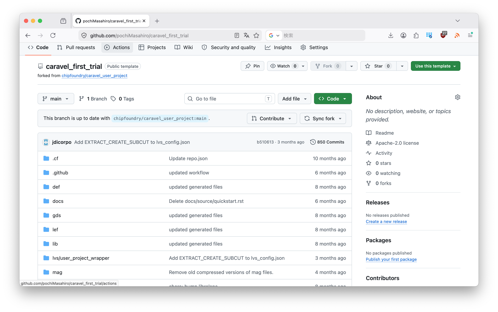
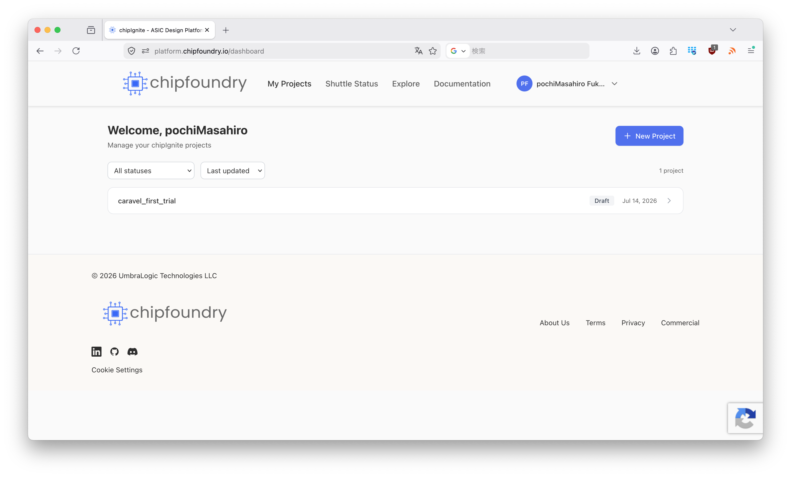
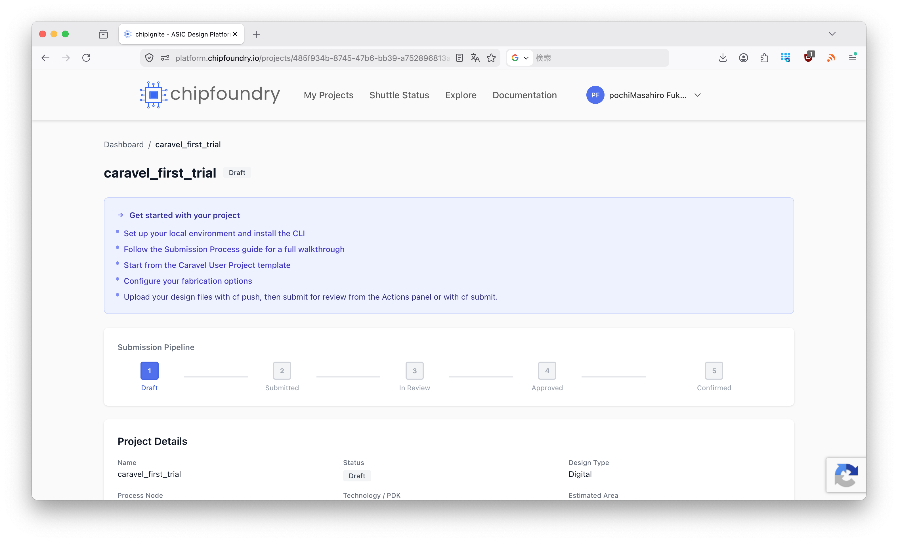
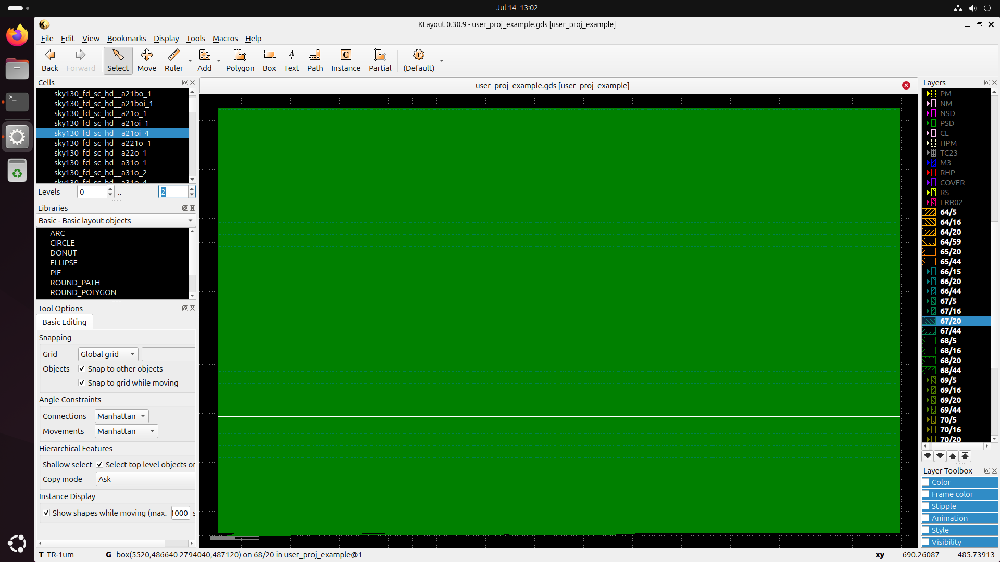
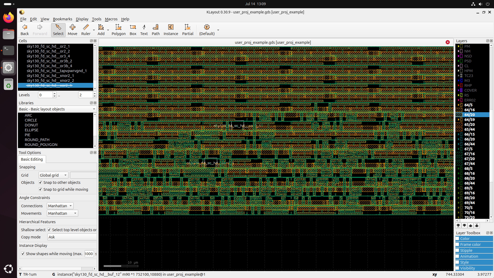

# 今週の作業概要
- ミーティング
- ChipFoundryのCaravel Templateを試す

# Caravel templateのお試し

## テンプレートリポジトリのフォーク

まずは自分のGitHubにcaravel user projectをフォークしてくる。（別プロジェクトをやるときにフォークしたリポジトリが残っていると、再度フォークすることができないので、リンクの外し方を調べておく）

carabel_first_trialとして、普段遣いのアカウントにフォークした。



## 環境構築

### チップファウンドリーツールのインストール

```cf``` というコマンドで合成その他諸々をやってくれるようなので、これをインストールする。Pythonのツールのようなので、 ```pip``` を用いてインストールするように指示があるが、普段は ```uv``` という環境を用いているので、これを使ってインストールするようにする。

まずはフォークしたプロジェクトを下記コマンドでローカルにクローンする。

```
git clone git@github.com:pochiMasahiro/caravel_first_trial.git
```

URIは自分のプロジェクトのURIを入れる。

```cd caravel_first_trial``` でクローンしたディレクトリに移動する。

```uv init``` としてpython環境を立ち上げる。```main.py``` は使わないので、削除しても構わない。

Pythonのバージョンは```3.8``` 以上を指定されているので、そのバージョンがインストールされているか確認する。

```uv python list```とすると、インストール済みバージョンが確認できるので、```3.8``` 以上があることを確かめる。

私の環境では以下のようであった。

```
$ uv python list
cpython-3.15.0a8-macos-aarch64-none                 <download available>
cpython-3.15.0a8+freethreaded-macos-aarch64-none    <download available>
cpython-3.14.4-macos-aarch64-none                   <download available>
cpython-3.14.4+freethreaded-macos-aarch64-none      <download available>
cpython-3.14.3-macos-aarch64-none                   /opt/homebrew/bin/python3.14 -> ../Cellar/python@3.14/3.14.3_1/bin/python3.14
cpython-3.14.3-macos-aarch64-none                   /opt/homebrew/bin/python3 -> ../Cellar/python@3.14/3.14.3_1/bin/python3
cpython-3.13.13-macos-aarch64-none                  <download available>
cpython-3.13.13+freethreaded-macos-aarch64-none     <download available>
cpython-3.12.13-macos-aarch64-none                  <download available>
cpython-3.11.15-macos-aarch64-none                  <download available>
cpython-3.10.20-macos-aarch64-none                  /opt/local/bin/python3.10 -> /opt/local/Library/Frameworks/Python.framework/Versions/3.10/bin/python3.10
cpython-3.10.20-macos-aarch64-none                  /Users/m_fukuoka/.local/share/uv/python/cpython-3.10-macos-aarch64-none/bin/python3.10
cpython-3.9.25-macos-aarch64-none                   <download available>
cpython-3.9.6-macos-aarch64-none                    /usr/bin/python3
cpython-3.8.20-macos-aarch64-none                   <download available>
pypy-3.11.15-macos-aarch64-none                     <download available>
pypy-3.10.16-macos-aarch64-none                     <download available>
pypy-3.9.19-macos-aarch64-none                      <download available>
pypy-3.8.16-macos-aarch64-none                      <download available>
graalpy-3.12.0-macos-aarch64-none                   <download available>
graalpy-3.11.0-macos-aarch64-none                   <download available>
graalpy-3.10.0-macos-aarch64-none                   <download available>
graalpy-3.8.5-macos-aarch64-none                    <download available>
```

```3.14``` が使えるので、これに固定する。```uv python pin 3.14``` とすることで、バージョンを固定できる。

ChipFoundryのツールをインストールする。クローンしたリポジトリには```pip```を使うように指示があるが、ここでは```uv``` を使うので、

```
uv add chipfoundry-cli
```

を実行する。これでcfコマンドが実行できるようになる。

### cfコマンドの確認

uvでインストールしたツールはコマンド名だけでは実行できず、コマンド名の前に```uv run``` を付ける必要がある。今後```cf```のみのコマンドあっても、```uv run```を先頭に付けて実行したことを意味する。

クローンしたプロジェクトの```README.md```に手順が書かれているので、実行していく。

まず、

```
uv run cf login
```

を実行する。これでWebページに飛んでchipfoundryにログインすることを求められる。メールアドレスからアカウントを作ることもできるようだが、ここではgoogleアカウントでログインした。ログイン無しでもこのあとの作業ができるのかは未確認だが、ログイン無しでできるならそのほうが良いかもしれない。

次に、

```
uv run cf init
```

を実行する。すると下記のようになる。

```
cf init — initializing new project
Project name
  current:  caravel_first_trial
  enter=accept, clear=remove, or type new value: 
Project type (digital/analog/openframe)
  current:  digital
  enter=accept, clear=remove, or type new value: 
Description
  enter=skip, or type value: 
GitHub repo URL
  current:  https://github.com/pochiMasahiro/caravel_first_trial
  enter=accept, clear=remove, or type new value: 

Available shuttles:
  1. CI2609 — submission deadline 2026-09-16
  2. CI2612 — submission deadline 2026-12-07
  3. Skip — choose later

Select shuttle: 3
Create a NEW platform project now? (Select 'No' if you intended to link an existing project with `cf link`.) [y/N]: y

✓ Project created on platform
  Name:    caravel_first_trial
  ID:      485f934b-8745-47b6-bb39-a752896813a1
  GitHub:  https://github.com/pochiMasahiro/caravel_first_trial
  Status:  Draft
  Portal:  https://platform.chipfoundry.io/projects/485f934b-8745-47b6-bb39-a752896813a1
```
Project name, Project type, Description, GitHub repo URLはそのままEnterで良い。Available shuttleは2であるが、これをテープアウトするわけではないので、3にしておく。Create a NEW platform project now?はyをしておく。これをすると先程ログインしたchipfoundryのプロジェクトページ内にこのプロジェクトが表示されるようである。必要がなければ、Nでもいいのかもしれない。

最後の項目でyを選ぶと下記のようにchipfoundryのDashboardに先程のプロジェクトが表示される。



プロジェクトをクリックすると、ページが遷移して現在のステータスを確認することができる。

テープアウトしてからのchipfoundry側での状態が確認できるようである。




### PDK、合成ツールのセットアップ

ここからは```Docker``` が必要になるのでインストールしておく。

```uv run cf setup``` を実行する。すると、

```
╭──────────────────────────────── Setup Configuration ─────────────────────────────────╮
│ ChipFoundry Project Setup                                                            │
│                                                                                      │
│ Project directory: /Users/m_fukuoka/Desktop/FirstTapeout_working/caravel_first_trial │
│ Repository: chipfoundry/caravel_user_project@main                                    │
│ PDK: sky130A                                                                         │
│ Project type: digital                                                                │
│ Caravel variant: caravel-lite                                                        │
│                                                                                      │
│ Installing: All components                                                           │
╰──────────────────────────────────────────────────────────────────────────────────────╯
Fetching version information from cf-cli repository...
✓ Version information loaded successfully
Step 1: Creating dependencies directory...
✓ Dependencies directory ready at /Users/m_fukuoka/Desktop/FirstTapeout_working/caravel_first_trial/dependencies

Step 2: Installing Caravel...
Cloning caravel-lite (tag: 2026.2.9)...
✓ Caravel-lite installed successfully

Step 3: Installing Management Core Wrapper...
Cloning mcw-litex-vexriscv (tag: 2026.2.9)...
✓ Management Core Wrapper installed successfully

Step 4: Installing OpenLane/LibreLane...
Creating OpenLane virtual environment...
Upgrading pip...
Installing LibreLane...
Saving package manifest...
✓ OpenLane/LibreLane installed successfully
LibreLane will auto-pull Docker images when needed

Step 5: Installing PDK with Ciel...
Creating Ciel virtual environment...
Installing Ciel...
✓ Ciel installed successfully
Enabling PDK sky130A with Ciel...
Downloading and installing PDK files...
✓ PDK installed successfully
PDK installed to: /Users/m_fukuoka/Desktop/FirstTapeout_working/caravel_first_trial/dependencies/pdks

Step 6: Installing timing scripts...
Cloning timing-scripts...
✓ Timing scripts installed

Step 7: Setting up Cocotb...
Creating Cocotb virtual environment...
Installing caravel-cocotb from source (chipfoundry/caravel-sim-infrastructure)...
✓ Cocotb environment set up successfully
Configuring Cocotb paths...
✓ Cocotb paths configured
Pulling Cocotb Docker image...
✓ Cocotb Docker image ready

Step 8: Installing precheck...
Installing cf-precheck...
✗ Failed to install cf-precheck: Command '['/Users/m_fukuoka/Desktop/FirstTapeout_working/caravel_first_trial/.venv/bin/python', '-m', 'pip', 'install', '--upgrade', '-q', 'cf-precheck']' returned non-zero exit
status 1.
/Users/m_fukuoka/Desktop/FirstTapeout_working/caravel_first_trial/.venv/bin/python: No module named pip


============================================================
Setup completed with errors. Review messages above.
```

のように、Step8が止まってしまう。ローカルにpipを作っていないためで、仕方ないので、venvを作って対処する。次のコマンドを入力した。

```
uv venv .venv --seed
source .venv/bin/activate
```

再度、```uv run cf setup```をする。すると、次のようにセットアップが完了した。

```
Installed 34 packages in 26ms
╭──────────────────────────────── Setup Configuration ─────────────────────────────────╮
│ ChipFoundry Project Setup                                                            │
│                                                                                      │
│ Project directory: /Users/m_fukuoka/Desktop/FirstTapeout_working/caravel_first_trial │
│ Repository: chipfoundry/caravel_user_project@main                                    │
│ PDK: sky130A                                                                         │
│ Project type: digital                                                                │
│ Caravel variant: caravel-lite                                                        │
│                                                                                      │
│ Installing: All components                                                           │
╰──────────────────────────────────────────────────────────────────────────────────────╯
Fetching version information from cf-cli repository...
✓ Version information loaded successfully
Step 1: Creating dependencies directory...
✓ Dependencies directory ready at /Users/m_fukuoka/Desktop/FirstTapeout_working/caravel_first_trial/dependencies

Step 2: Installing Caravel...
✓ Caravel-lite already installed (version: 2026.2.9)

Step 3: Installing Management Core Wrapper...
✓ MCW already installed (version: 2026.2.9)

Step 4: Installing OpenLane/LibreLane...
✓ OpenLane/LibreLane already installed (version: CI2511)

Step 5: Installing PDK with Ciel...
✓ PDK sky130A already installed (commit: 3e0e31d)

Step 6: Installing timing scripts...
✓ Timing scripts already installed

Step 7: Setting up Cocotb...
✓ Cocotb already installed

Step 8: Installing precheck...
Installing cf-precheck...
✓ cf-precheck v1.3.1 installed

============================================================
Setup complete!
```

## 合成のお試し

テンプレートにもお試しのデザインが入っているので、それを一旦合成してみる。

合成できるデザインは

```
uv run cf harden --list
```

で確認できる。クローンした状態では、

```
Available macros:
  • user_proj_example (config.json)
  • user_project_wrapper (config.json)
```

の２種類があるようである。

どちらが何なのかはよくわからないが、```user_proj_example```を合成してみる。

```
uv run cf harden user_proj_example
```

と入力する。

```
Fetching version information from cf-cli repository...
✓ Version information loaded successfully

============================================================
Hardening: user_proj_example
Config: config.json
Run tag: 26_07_14_12_09
PDK: sky130A
PDK Root: /Users/m_fukuoka/Desktop/FirstTapeout_working/caravel_first_trial/dependencies/pdks
Execution: Docker
============================================================

Running LibreLane via Docker on user_proj_example...
2.4.6: Pulling from librelane/librelane
98406d2ebf28: Download complete 
b2f0dd1f27bd: Extracting 5 s
```

Dockerがいろいろダウンロードしてきて、終わると大量のメッセージが表示されるので終わるまでのんびり待つ。（３０分ちょっとかかる）

## 合成結果の確認

```GDS```ディレクトリに合成結果が出力される。今回であれば、```user_proj_example.gds``` が出力されるので、それをklayoutで確認する。

合成結果



dummyやdecapで埋められていてよくわからないので、下の方を拡大してみると。



何かしらのセルと配線が形成されていることがわかる。試しにxorを非表示にしてみると、四角く囲われていて、xorがいることが確認できる。

## まとめ

とりあえずChipFoundryのツールを使ってgdsを出力するフローは確認できた。GDSのサイズやピンの取り出す位置、タイミング制約の指定がよくわからんので、そのへんを調べて自身のデザインで合成する方法を明らかにする必要がある。

