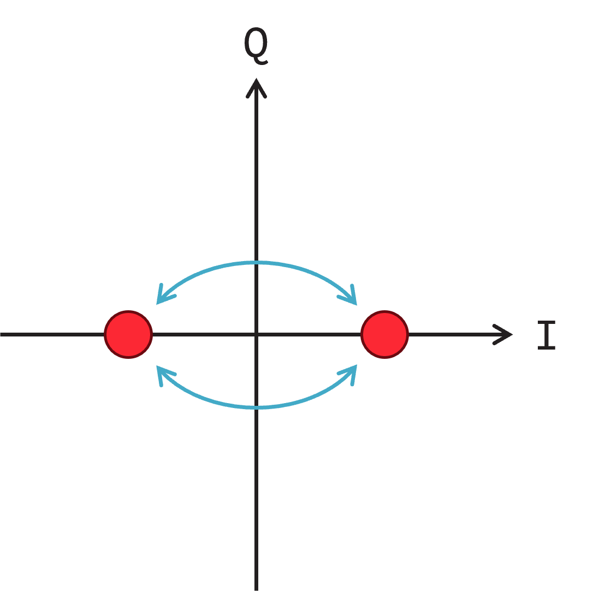
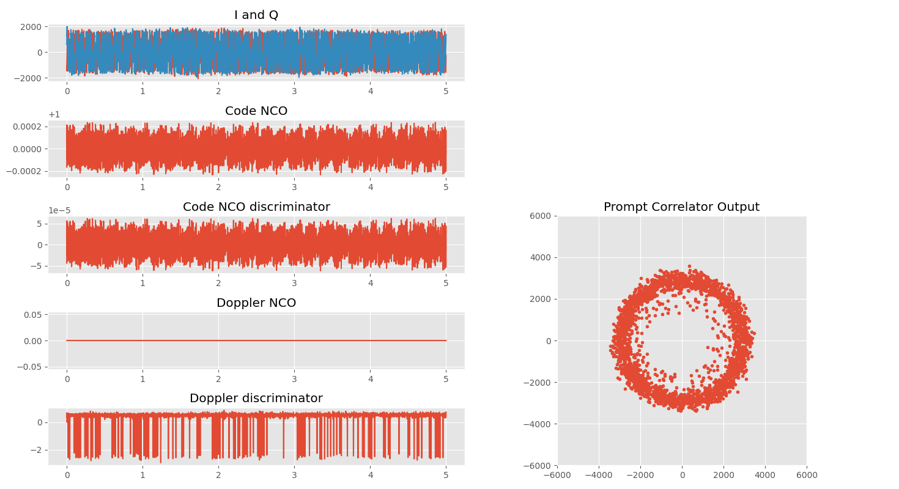
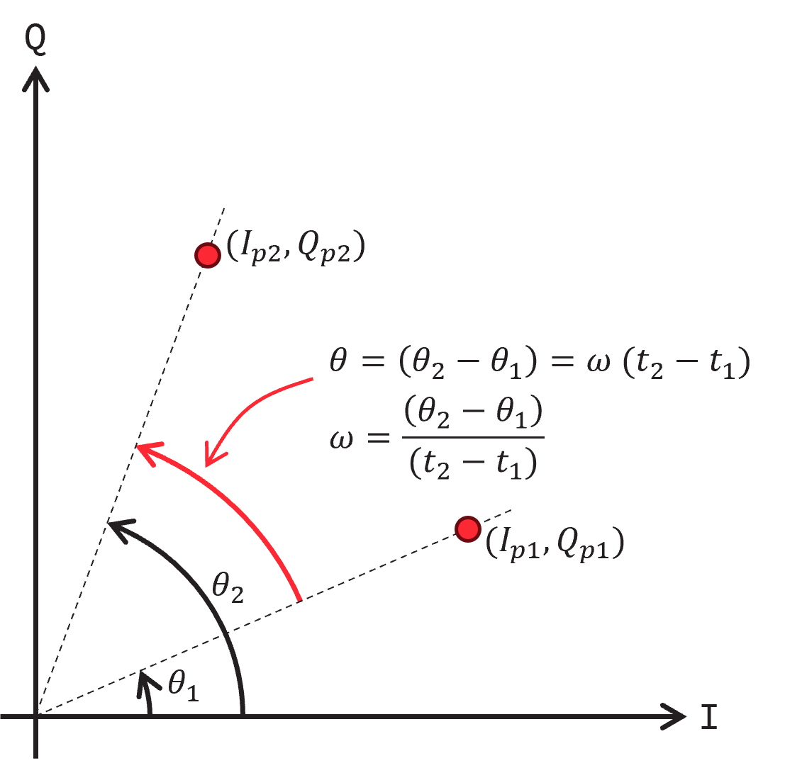
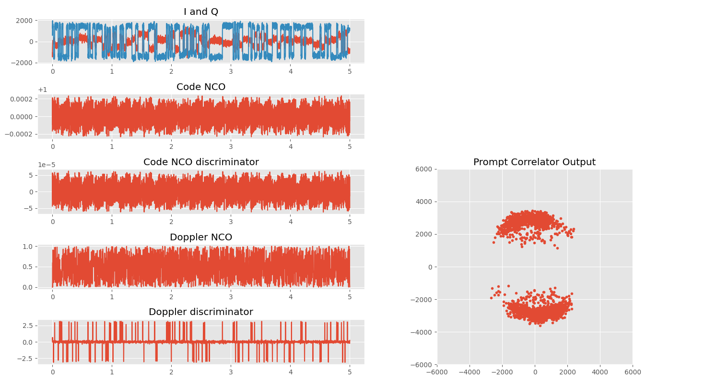

# 今週の作業概要

- 物品調達について
- 逆拡散処理のためのディレイロックループ・ドップラー周波数補正のための周波数ロックループ

# アルゴリズム検証

## 前回の実装ミス

前回ドップラーシフトの補正として下記のようなコードを使用していた。

```
# ドップラーシフト周波数の信号生成
carrier_i = np.cos(phase)
carrier_q = np.sin(phase)

# ドップラーシフトの補正
i_mixed = carrier_i * i
q_mixed = carrier_q * q
```

これを理解するために受信信号の$i$及び$q$も三角関数であると仮定し、$i=\cos \omega_s t$及び$q =\sin \omega_s t$とする。ドップラー角速度を$\omega_f$とすると、上記コードの演算は、

$$
\begin{align}
i_{mixed} = \cos\left(\omega_st\right)\cos\left(\omega_ft\right) \\
i_{mixed} = \cos\left(\omega_st\right)\cos\left(\omega_ft\right) \\
\end{align}
$$


## GPS信号の受信処理

### 送信機（衛星）と受信機の関係

送信機（衛星）と受信器は大まかに次の図のような信号処理を行っている。


送信機は50 bpsの航法データを1.023 MHzの疑似ランダム符号でモジュロ演算(排他的論理和)を行い、その2値信号をBPSK(Binary pahse shift keying)により、1575.42 MHzのキャリア信号を変調して送信している。

キャリアに対するコンスタレーションを描くと次の図のようになる。GPSのBPSK変調はキャリアと同相成分に変調を行い、振幅が反対になる箇所に相当する場所に符号を割り当てている。



受信器では1575.42MHzのキャリアレプリカ信号を作って、BPSK信号をダウンコンバージョンし、C/Aコードのレプリカ生成器で逆拡散(相互相関)を行って、航法データを復調する。

前回の信号探索からダウンコンバージョンした信号は単純に復調できるわけでなく、ドップラーシフトによるキャリア周波数シフトを補正し、C/Aコードのコード位相(遅延)も合わせる必要がある。また、これらは衛星の移動により変化するため、変化を追尾する機構が必要となる。ベースバンドプロセッサでは、ドップラーシフト、C/Aコード位相を追尾するシステムを実装し、航法データの復調までを行う。

### ベースバンドプロセッサの構成

ベースバンドプロセッサの構成は下記のようになる。


左のI/QはRFフロントエンドでA/DされたIF信号である。I/Qそれぞれにつながるミキサ(直交ミキサ)でIF周波数＋ドップラー周波数のミキシングを行う。ミキサ出力はそれぞれが補正された状態で出てくるので、3種類のコード位相で相互相関を取る。航法データはI信号のPrompt(位相が一致している状態)の相関値から復調される。

ドップラーシフトの追尾とC/Aコード遅延の追尾を行うために2つのループがある。ドップラーシフトの追尾を行うループはFLLまたはPLLであり、コード遅延の追尾を行うループがDLLである。

### DLL

DLLはDelay Locked Loopであり、遅延を特定の状態にロックするためのフィードバック制御である。コードが遅れている状態(late)、一致している状態(prompt)、進んでいる状態(early)の3種類で相関値を取得して、promptの相関値が最大になるようにコード位相を制御する。コード遅延に対する相関値は次の図のように表される。


横軸はコード遅延である。単位はチップ(コード1個単位)で表されている。コード遅延が0のときに相関値は最大になり1チップずれるとほぼゼロになるが、小数遅延を導入すると、コード遅延0をピークとする単峰性の直線を描く。このとき下図のように±0.5チップの遅延(EarlyとLate)と0(Prompt)の相関を取得すると、次の3点になる。


ここでコード遅延がズレていたときの相関値を考えると、下の図の用になる。


もしレプリカコードの方が信号のコードより進んでいた場合、Promptは0の右側にある。このとき、LateとEarlyの関係を見ると、Lateの相関の方がEarlyより高い。なので、$Early - Late$とするとその符号は負になる。一方で、レプリカコードが信号のコードより遅れていた場合、Promptは0の左側にあり、Lateの相関はEarlyより小さくなる。同様に$Early - Late$を考えると、符号は正になる。また一致していれば、EarlyとLateは同じ値となるので、差は0となる。このように、±0.5チップの差分を取ることで、レプリカコードのズレを示すディスクリミネータとして動作する。

相関の値は信号強度によって変化することからディスクリミネータの出力を強度に依存しない値とするために正規化する必要がある。

そこでディスクリミネータ$E$は、Early、Lateの相関強度$P_E$と$P_L$を用いて次のように定義される。

$$
\begin{align}
P_E = i_{E}^2 + q_{E}^2 \\
P_L = i_{L}^2 + q_{L}^2 \\
E = \frac{P_E - P_L}{P_E + P_L}
\end{align}
$$ 

これを適当なループフィルタを通して、レプリカコードジェネレーターのNCO(数値制御発振器)の周波数にフィードバックする。今回はエラーを比例係数のみでフィードバックするP制御とした。

DLLでコード遅延をロックした状態の結果を下図に示す。



左側上から、Promptの相関器出力、レプリカコード生成NCOの角周波数、コード位相ディスクリミネータ出力、ドップラーシフトNCOの角周波数、ドップラーシフトディスクリミネータの出力、右側はPrompt相関器の出力をI/Qでプロットしたものである。

右側のI/Qプロットから、相関器出力は常に大きな状態を維持しており、信号が検出できていることがわかる。ただし、ドップラーシフトを補正していないため、位相が回転していることからプロットは円を描くようになる。ここからドップラーシフトを補正すると、BPSKの2つの符号割り当てが見えてくる。次にドップラーシフト補正を試みる。

### FLLとPLL

ドップラーシフトを補正するにはドップラー周波数を推定しなければならない。このために、時間的に連続した2つのPromptの相関値($I_{p1}$、$Q_{p1}$、$I_{p2}$、$Q_{p2}$)を使用する。

これらの相関値をIQ軸にプロットすると次のようになる。



ドップラーシフトがある状態とは、IQ平面上で位相が回転している状態を表す。ドップラーシフトをキャンセルするためには回転した位相を元に戻してやればいいので、回転変換を行えばいい。回転変換を行うためには、角速度が必要になるので角速度を連続する２点の位相変化から求める。座標(三角比)がわかっているときに、角度を求める操作は正弦正接の逆関数、アークタンジェントを使えば求まるので、$\theta_1$、$\theta_2$はそれぞれ、

$$
\begin{align}
\theta_1 = \tan^{-1}\left( \frac{Q_{p1}}{I_{p1}}\right)
\theta_2 = \tan^{-1}\left( \frac{Q_{p2}}{I_{p2}}\right)
\end{align}
$$

となる。したがって、角速度$\omega$は

$$
\begin{align}
\omega = \frac{\tan^-1\left(\frac{Q_2}{I_2}\right) - \tan^-1\left(\frac{Q_1}{I_1}\right)}{(t_2 - t_1)}
\end{align}
$$

となる。ここで、

$$
\tan^{-1}\left( A \right) - \tan^{-1}\left( B \right) = \tan^{-1}\left( \frac{A-B}{1+AB}\right)
$$

なので、$A=\frac{Q_2}{I_2}$、$B=\frac{Q_1}{I_1}$とすると、

$$
\begin{align}
A-B = \frac{Q_2}{I_2} - \frac{Q_1}{I_1} = \frac{I_1Q_2 - I_2Q_1}{I_1I_2} \\
1 + AB = 1 + \left(\frac{Q1}{I1}\right)\left(\frac{Q2}{I2}\right) = 1+\frac{Q_1Q_2}{I_1I_2} = \frac{I_1I_2 + Q_1Q_2}{I_1I_2} \\
\end{align}
$$

となる。したがって、

$$
\begin{align}
\frac{A-B}{1+AB} &= \frac{\frac{I_1Q_2 - I_2Q_1}{I_1I_2}}{\frac{I_1I_2 + Q_1Q_2}
{I_1I_2}} = \frac{I_1Q_2 - I_2Q_1}{I_1I_2 + Q_1Q_2}
\end{align}
$$

となる。これらより、

$$
\tan^-1\left(\frac{Q_2}{I_2}\right) - \tan^-1\left(\frac{Q_1}{I_1}\right) = \tan^{-1}\left(\frac{I_1Q_2 - I_2Q_1}{I_1I_2 + Q_1Q_2}\right)
$$

であるから、$dot = I_1I_2 + Q_1Q_2$、$cross = I_1Q_2 - I_2Q_1$とすると、FLLのディスクリミネータ$E$は、

$$
E = \frac{\tan^{-1} \left( \frac{dot}{cross} \right)}{t_2 - t_1}
$$

となる。正接関数の定義域は$-\frac{\pi}{2} \sim \frac{\pi}{2}$となり、第２象限と第４象限の値を表現できないことから不便なため、プログラム上では全域で定義できるatan2を使用している。atan2(dot, cross)として定義されているため、全域$\left(-\pi \sim \pi\right)$をすべて表現できる。

FLLのフィードバックも、DLLと同様に比例係数のみでフィードバックするP制御として実装した。DLLとFLLを同時に実行したときの結果を下図に示す。



右側のIQでプロットを見ると、点が概ね２つの領域に分かれていることがわかり、航法データの2値が表現できていいることがわかる。しかしながら、Q軸上にデータが集まってしまっている。本来Q軸を対称軸としてI軸上にデータが集まることが期待される。これは、FLLが角速度のみに注目しているためであり、受信器のドップラー補正NCOの位相のスタート地点がI軸上にないからである。

位相を特定の時点である値にロックする制御がPLL(Phase locked loop)である。
