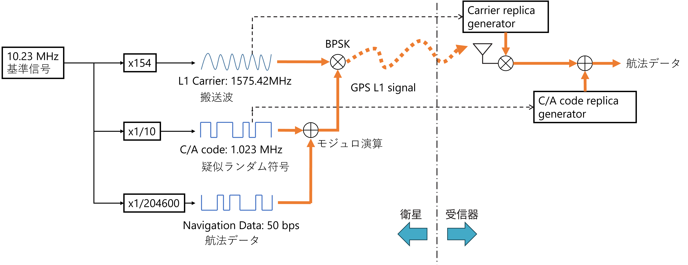
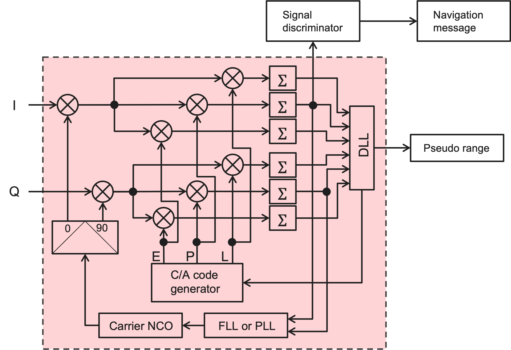
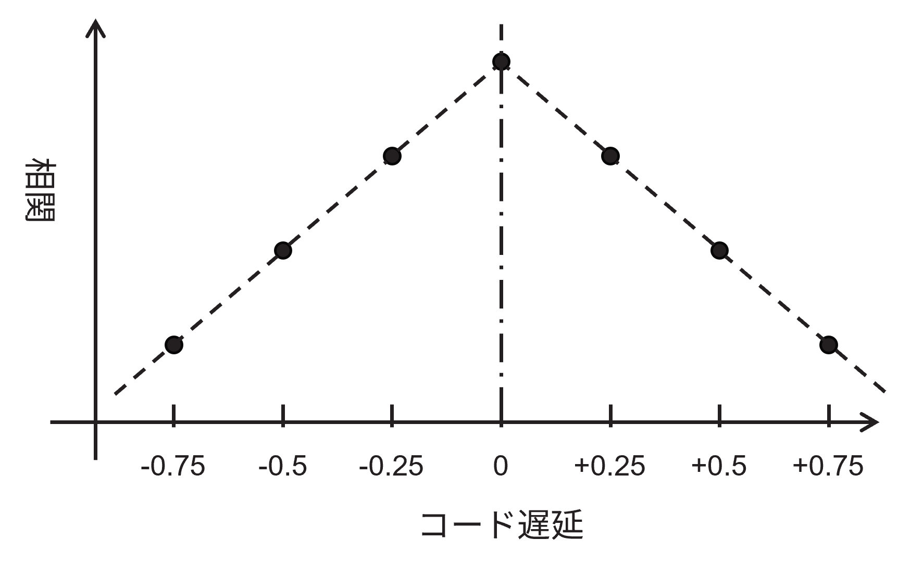
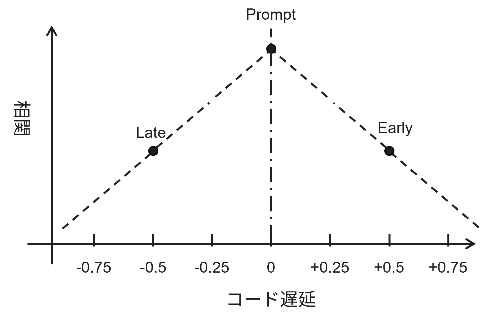
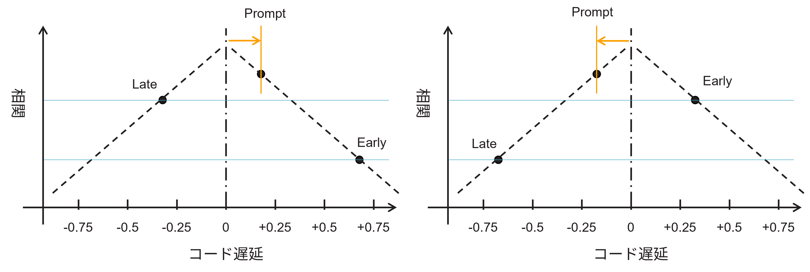

# 今週の作業概要

- 物品調達について
- 逆拡散処理のためのディレイロックループ・ドップラー周波数補正のための周波数ロックループ

# アルゴリズム検証

## 前回の実装ミス

## GPS信号の受信処理

### 送信機（衛星）と受信機の関係

送信機（衛星）と受信器は大まかに次の図のような信号処理を行っている。

送信機は50 bpsの航法データを1.023 MHzの疑似ランダム符号でモジュロ演算(排他的論理和)を行い、その2値信号をBPSK(Binary pahse shift keying)により、1575.42 MHzのキャリア信号を変調して送信している。

受信器では1575.42MHzのキャリアレプリカ信号を作って、BPSK信号をダウンコンバージョンし、C/Aコードのレプリカ生成器で逆拡散(相互相関)を行って、航法データを復調している。

前回の信号探索からダウンコンバージョンした信号は単純に復調できるわけでなく、ドップラーシフトによるキャリア周波数シフトを含み、C/Aコードのコード位相(遅延)も合わせる必要がある。また、これらは衛星の移動により変化するため、変化を追尾する機構が必要となる。ベースバンドプロセッサでは、ドップラーシフト、C/Aコード位相を追尾するシステムを実装し、航法データの復調までを行う。

### ベースバンドプロセッサの構成

ベースバンドプロセッサの構成は下記のようになる。

左のI/QはRFフロントエンドでA/DされたIF信号である。I/Qそれぞれにつながるミキサ(直交ミキサ)でIF周波数＋ドップラー周波数のミキシングを行う。ミキサ出力はそれぞれが補正された状態で出てくるので、3種類のコード位相で相互相関を取る。航法データはI信号のPrompt(位相が一致している状態)の相関値から復調される。

ドップラーシフトの追尾とC/Aコード遅延の追尾を行うために2つのループがある。ドップラーシフトの追尾を行うループはFLLまたはPLLであり、コード遅延の追尾を行うループがDLLである。

### DLL

DLLはDelay Locked Loopであり、遅延を特定の状態にロックするためのフィードバック制御である。コードが遅れている状態(late)、一致している状態(prompt)、進んでいる状態(early)の3種類で相関値を取得して、promptの相関値が最大になるようにコード位相を制御する。コード遅延に対する相関値は次の図のように表される。

横軸はコード遅延である。単位はチップ(コード1個単位)で表されている。コード遅延が0のときに相関値は最大になり1チップずれるとほぼゼロになるが、小数遅延を導入すると、コード遅延0をピークとする単峰性の直線を描く。このとき下図のように±0.5チップの遅延(EarlyとLate)と0(Prompt)の相関を取得すると、次の3点になる。

ここでコード遅延がズレていたときの相関値を考えると、下の図の用になる。

もしレプリカコードの方が信号のコードより進んでいた場合、Promptは0の右側にある。このとき、LateとEarlyの関係を見ると、Lateの相関の方がEarlyより高い。なので、$Early - Late$とするとその符号は負になる。一方で、レプリカコードが信号のコードより遅れていた場合、Promptは0の左側にあり、Lateの相関はEarlyより小さくなる。同様に$Early - Late$を考えると、符号は正になる。また一致していれば、EarlyとLateは同じ値となるので、差は0となる。このように、±0.5チップの差分を取ることで、レプリカコードのズレを示すディスクリミネータとして動作する。

相関の値は信号強度によって変化することからディスクリミネータの出力を強度に依存しない値とするために正規化する必要がある。

そこでディスクリミネータ$E$は、Early、Lateの相関強度$P_E$と$P_L$を用いて次のように定義される。

$$
\begin{align}
P_E = i_{E}^2 + q_{E}^2 \\
P_L = i_{L}^2 + q_{L}^2 \\
E = \frac{P_E - P_L}{P_E + P_L}
\end{align}
$$ 

これを適当なループフィルタを通して、レプリカコードジェネレーターのNCO(数値制御発振器)の周波数にフィードバックする。今回はエラーを比例係数のみでフィードバックするP制御とした。

DLLでコード遅延をロックした状態の結果を下図に示す。

### FLLとPLL

