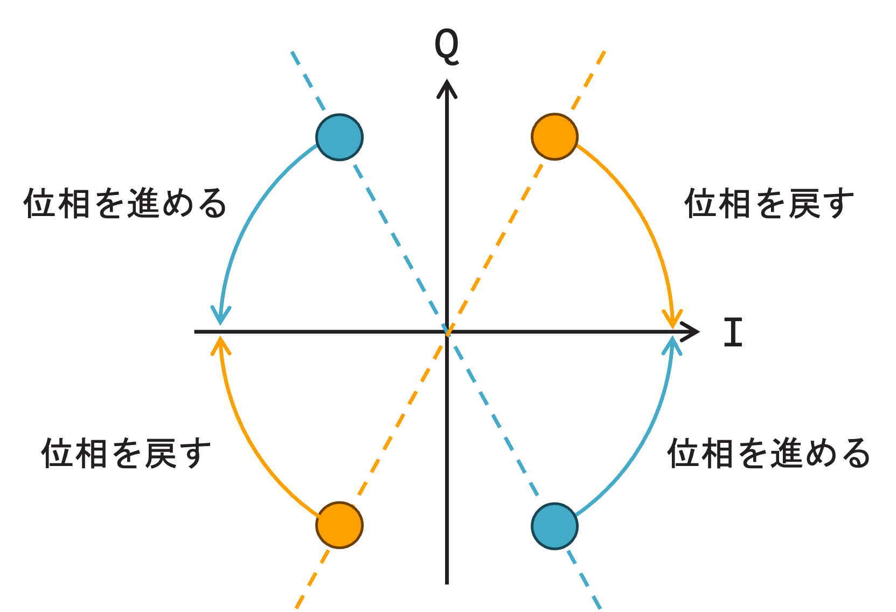
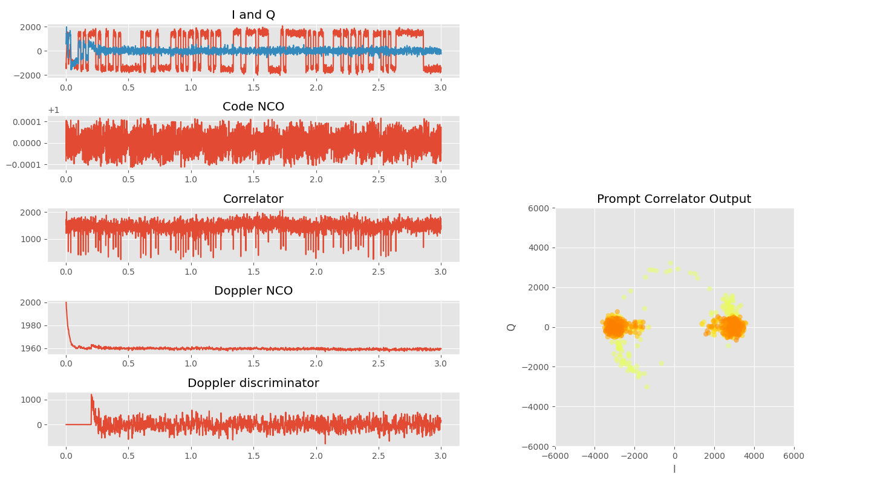

# 今週の作業概要

- 物品調達について
- 航法メッセージ復調に向けた位相同期ループの実装

# アルゴリズム検証

## GPS受信機におけるPLLの概要

GPSはキャリアと同相のBPSKなので、コンスタレーション(I/Qプロット)のI軸上にQ軸を対称として正負の同じ距離に符号が設定されている。前回はFLLまでを実装したので、データがI軸上にはなっていなかった。これはFLLではキャリア(ドップラー)の周波数には合っているが、位相は合っていないためである。そこで、FLLが十分にロックした後には、位相を合わせるPLLに以降する必要がある。

FLLのディスクリミネータは周波数差を出力していた。PLLでは位相を合わせなければならないので、位相差を出力するディスクリミネータを構成する必要がある。しかしながら、GPSの信号はBPSKなので、コードに合わせて位相が180度反転する。したがって、PLLでよく使われるいわゆるPFD(Phase Frequency Detector)は使えない。そこでBPSK信号に対応したPLLのディスクリミネータとして、Costasディスクリミネータが使われる。

Costasディスクリミネータを考える前に、FLLで２つに分かれたコンスターレンションからどのように、I軸上にデータを集めるのか考える。FLL後のコンスタレーションは下の図のようになる。

FLLによって符号点は２つに分かれるが、その２つは原点対称に配置する。したがって、青のように第2象限と第4象限または橙のように第1象限と第3象限に集まる。この2パターンでI軸上にデータを集めるには、青の場合は位相を進める、橙の場合は位相を戻すことが有効である。

このようになるディスクリミネータを考える。角度を考えるのでATAN2でも良いが、前述の通りコードにより180度の位相回転を生じるので、正確なロックは期待できない。そこで、次の式をディスクリミネータとして使用する。

$$
\begin{align}
Q_n \times sign(I_n)
\end{align}
$$

この式について考察していく。I軸上からの距離を考える。I軸上からの距離は $Q_n$ で表すのが良い。これを2つのパターンに当てはめて考える。まず、青色のパターンを考える。青色のパターンでは、第2象限の符号は $(sign(I_n), sign(Q_n)) = (-,+)$ 、第4象限の符号は $(sign(I_n), sign(Q_n)) = (+,-)$ となる。ここで、 $sign(I_n) \times sign(Q_n)$ を考えると、両方のパターンで負となる。同様に橙のパターンを考えると、第1象限の符号は $(sign(I_n), sign(Q_n)) = (+,+)$ 、第3象限の符号は $(sign(I_n), sign(Q_n)) = (-,-)$ となる。したがって、 $sign(I_n) \times sign(Q_n)$ は両方とも正となる。これと $Q_n$ を組み合わせ $Q_n \times sign(I_n)$ とすると、青のパターン、橙のパターン両方ともで位相を進めるか、戻すかを決めるディスクリミネータとして使うことができる。このディスクリミネータをCostas discriminatorという。また、このディスクリミネータを使ったPLLをCostas PLLと呼称する。

## FLLとCostas PLLの切り替え

FLLからCostas PLLは自動で切り替わらないと不便なので、切り替えのアルゴリズムを考える。FLLからCostas PLLへはFLLの周波数が十分にロックしたと考えられる状態になれば良い。十分にロックしたと考えられる状態としては、経験則としてFLLによる周波数変化が5Hz程度に収束した状態を周波数が十分にロックしたと考えるようである。

そこで、今回はFLLによる周波数変化が10Hz以内になっている状態を100回維持したら、PLLに移行すると設定した。

下記にPLLまでロックすることを確認した結果を示す。

左側の上からPrompt correlatorのI/Q信号、Code NCOの周波数変化、Prompt correlatorの長さ( $\sqrt{I_n^2 + Q_n^2}$ )、ドップラーNCOの周波数、ドップラーディスクリミネータ(FLLとPLL両方のディスクリミネータを連続して表示）である。右側はPrompt correlatorのI/Q信号をコンステレーションプロットとして表示したものである。黄色が過去、オレンジ色が最新となるようにプロットしている。

0.2秒付近でPLLに切り替わり、切り替わり直後に若干周波数が不連続になるが、100ms以内にFLLから連続する周波数に収束する。位相ロック後はPrompt correlatorのQ信号はほぼゼロを維持し、I信号は2値を示していて、航法データらしきものを読み取ることができる。コンステレーションも散らばっていた状態からI軸上にQ軸対称の位置にデータが集まっており、PLLがロックできていることを確認できる。

次週はI信号のデータ列を解析してGPS衛星の航法データを意味ある形として取り出すこと行う。
