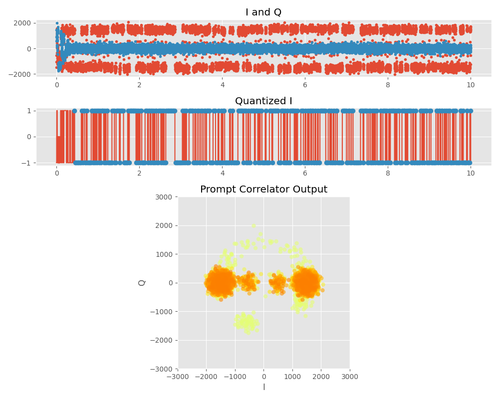
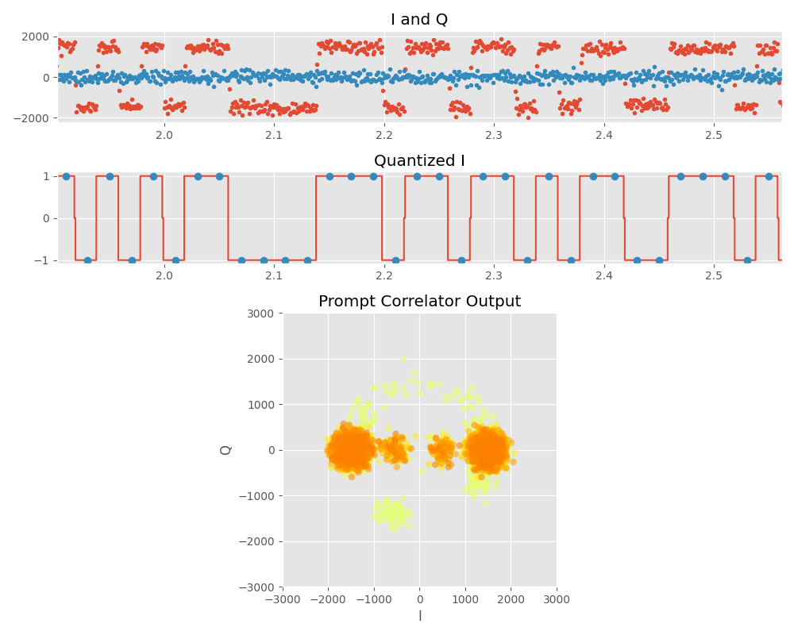

# 今週の作業概要

- 物品調達について岡村さんの情報提供
- 航法メッセージ復調に向けた位相同期ループの実装

# アルゴリズム検証

## GPS受信機における航法メッセージの取得

PLLまで完了すると1ms間隔でデータが出力され、航法データに合わせてその値が変化する。航法データは50bpsなので、データの切り替わりを見つけ、そこから10ms後のデータが最も変化しない点での値を取得して、そのタイミングで航法データとする。航法データはNRZ(Non return to zero)なので、同じ符号が連続すると、同じ値が出続けるため切り替わりが現れない。そこでデータ取得はデータ取得カウンタの値をベースに行う。データ取得カウンタはデータ切り替わりでカウントを開始し、カウント開始10ms後からデータを取得、以降20ms間隔でデータを取得する。内部クロックとGPSクロックはズレているので、データ切り替わりは常に監視し、データ取得カウンタとの誤差が一定以上になった時点でデータ取得カウンタをリセットする。

これにより得られたでデータを次に示す。データは10秒間とし、相関値のしきい値は±500とした。PLLのロック判定は簡易に400ms以上としている。

QuantizedIが量子化したままのデータであり、-1,0,1を取る。ここから、青のドットはデータ取得点である。

よくわからないので拡大すると、下記の様になる。

このように20ms間隔でデータを取得できていることがわかる。

ここからデータの先頭を示すプリアンブルを探し、航法データを復元することを行う。

現状２週間程度遅延しているので、なるべく急ぐ。